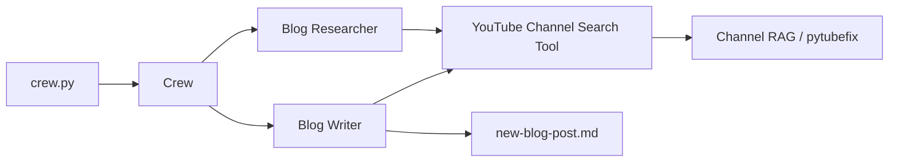

# YouTube Blog Creator

An AI-powered pipeline that turns content from a YouTube channel into a written blog post. It uses [CrewAI](https://github.com/joaomdmoura/crewAI) agents to research a topic via channel search, then draft a markdown article saved to `new-blog-post.md`.

## Features

- **YouTube channel RAG** — Indexes a configured channel and retrieves relevant video context for a given topic.
- **Two-agent workflow** — A researcher agent gathers material; a writer agent produces the final post.
- **Markdown output** — Generated posts are written to `new-blog-post.md` in the project root.
- **pytubefix compatibility** — Patches for `crewai_tools` and `pytubefix` so channel loading works when YouTube APIs change.

## How it works



1. **Research** — The researcher searches the YouTube channel for content related to `{topic}`.
2. **Write** — The writer uses the same tool and research context to produce a blog post.
3. **Output** — The write task saves the result to `new-blog-post.md`.

## Prerequisites

- Python 3.10 or newer
- An [OpenAI API key](https://platform.openai.com/api-keys) (default model: `gpt-4o-mini`)
- Internet access (YouTube channel indexing and LLM API calls)
- Sufficient OpenAI quota — two agents run sequentially with multiple LLM calls per run

## Installation

```bash
git clone https://github.com/Geekynerd1605/YouTube-Video-Blog-Generator-using-CrewAI
cd yt-blog-creator

python -m venv venv
source venv/bin/activate   # Windows: venv\Scripts\activate

pip install -r requirements.txt
```

> **Note:** The first `pip install` can take several minutes. `pytubefix` may pull in Node.js-related wheels used internally by the YouTube tooling stack.

## Configuration

1. Copy the environment template:

   ```bash
   cp .env.example .env
   ```

2. Edit `.env` and set your key (this file is gitignored — do not commit it):

   ```env
   OPENAI_API_KEY=your_openai_api_key_here
   ```

3. Optional: change the source YouTube channel in `tools.py` by updating `youtube_channel_handle` (default: `@krishnaik06`).

## Usage

Run the crew from the project root:

```bash
python crew.py
```

Change the blog topic in `crew.py` inside `crew.kickoff(inputs={...})`:

```python
result = crew.kickoff(inputs={"topic": "Why Oracle Laid Off 30k Employees Despite Strong Revenue Growth"})
```

After a successful run, open `new-blog-post.md` for the generated article. A sample output from a prior run is included in the repo for reference.

> **First run:** The channel search tool builds a RAG index over the configured YouTube channel. The first execution is often slower than later runs while embeddings and channel data are prepared.

## Project structure

| File | Role |
|------|------|
| `crew.py` | Entry point: builds the Crew and runs `kickoff()` |
| `agents.py` | Researcher and writer agents, LLM and API key setup |
| `tasks.py` | Research and write tasks (prompts and expected outputs) |
| `tools.py` | YouTube channel search tool, URL normalization, pytubefix patches |
| `requirements.txt` | Python dependencies (unpinned) |
| `.env.example` | Template for `OPENAI_API_KEY` |
| `.env` | Your secrets (create locally; not in git) |
| `new-blog-post.md` | Generated blog output (overwritten on each write task) |

## Customization

| What to change | Where |
|----------------|--------|
| Blog topic | `crew.py` → `inputs={"topic": "..."}` |
| YouTube channel | `tools.py` → `youtube_channel_handle` |
| LLM model | `agents.py` → `LLM(model="...")` |
| Agent roles / backstories | `agents.py` |
| Task instructions | `tasks.py` |
| Search sensitivity | `tools.py` → `similarity_threshold`, `limit` |
| Research depth (iterations) | `agents.py` → `max_iter` on `blog_researcher` |

## Dependencies

Listed in `requirements.txt` (versions are not pinned; pin them for reproducible installs if needed):

| Package | Purpose |
|---------|---------|
| `crewai` | Multi-agent orchestration |
| `crewai_tools` | `YoutubeChannelSearchTool` and channel RAG |
| `python-dotenv` | Load `OPENAI_API_KEY` from `.env` |
| `langchain-huggingface` | Supporting dependency in the CrewAI / tools stack |
| `pytubefix` | YouTube channel and video access (patched for compatibility) |

## Known limitations

- Only searches the **one channel** configured in `tools.py` (not arbitrary YouTube URLs without code changes).
- Requires a **valid OpenAI API key**; there is no local/offline LLM path in the current code.
- Output quality depends on whether the channel has relevant videos for your topic and on RAG retrieval settings.
- Each run **overwrites** `new-blog-post.md`.

## Troubleshooting

| Issue | What to try |
|-------|-------------|
| Missing or invalid API key | Ensure `.env` has `OPENAI_API_KEY`; restart the shell after editing `.env`. |
| Channel / search errors | Use a valid `@handle` or full channel URL in `tools.py`; see comments in `tools.py`. |
| Empty or weak RAG results | Lower `similarity_threshold` in `tools.py` (default `0.28`). |
| Very slow first run | Normal while the channel index is built; wait for completion. |
| High API usage | Reduce `max_iter` on the researcher in `agents.py` or use a cheaper model. |
| Rare Linux shutdown error | `crew.py` includes a short delay after run to avoid a stdin lock issue with background threads. |

## Disclaimer

Use this project responsibly. Respect [YouTube’s Terms of Service](https://www.youtube.com/t/terms) and content creators’ rights. Generated posts are AI summaries and should be reviewed before publication. OpenAI usage incurs charges on your account.

## Credits

- **Author:** Swastika Dalmia
- **Inspiration / tutorials:** Krishnaik YouTube channel
- **Libraries:** [CrewAI](https://github.com/joaomdmoura/crewAI), [crewai-tools](https://github.com/joaomdmoura/crewai-tools), [pytubefix](https://github.com/JuanBindez/pytubefix)
- **Special thanks:** Krish Naik
